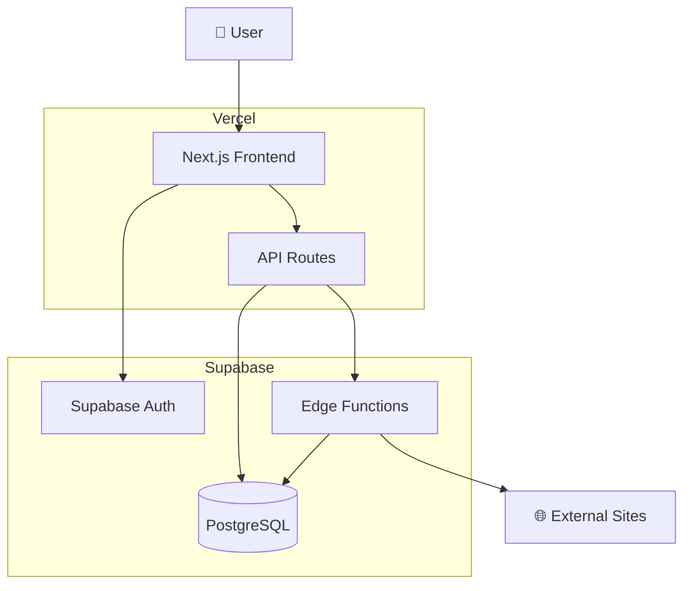
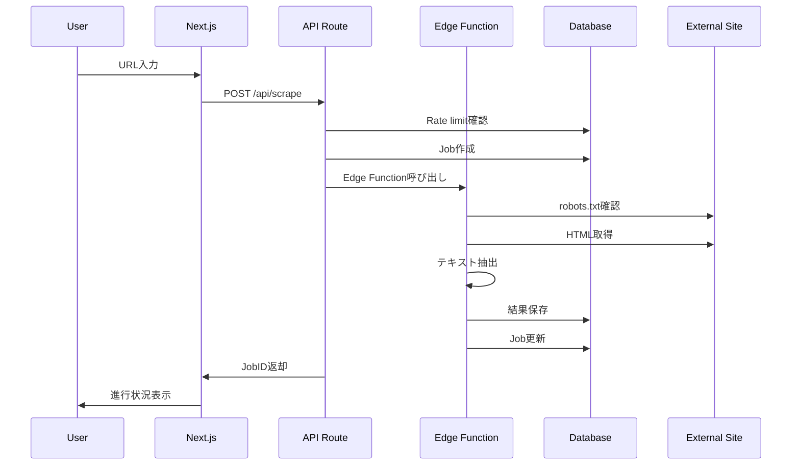
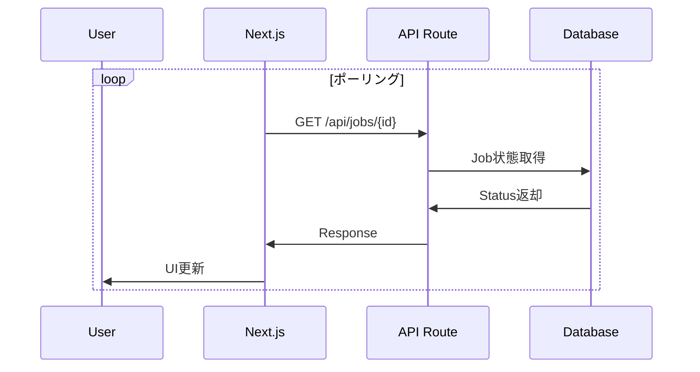
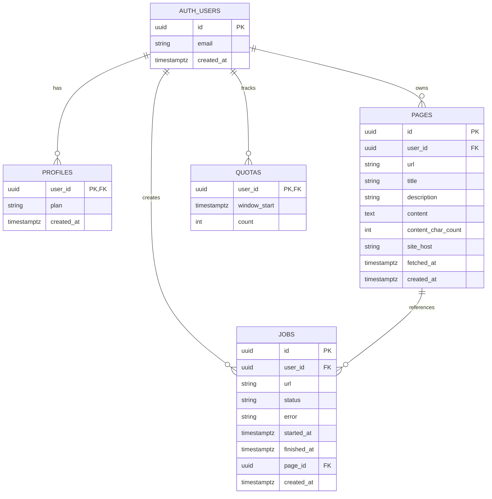
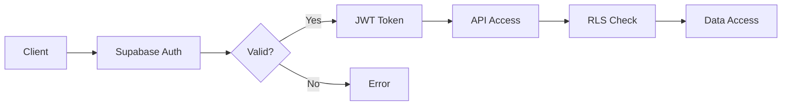
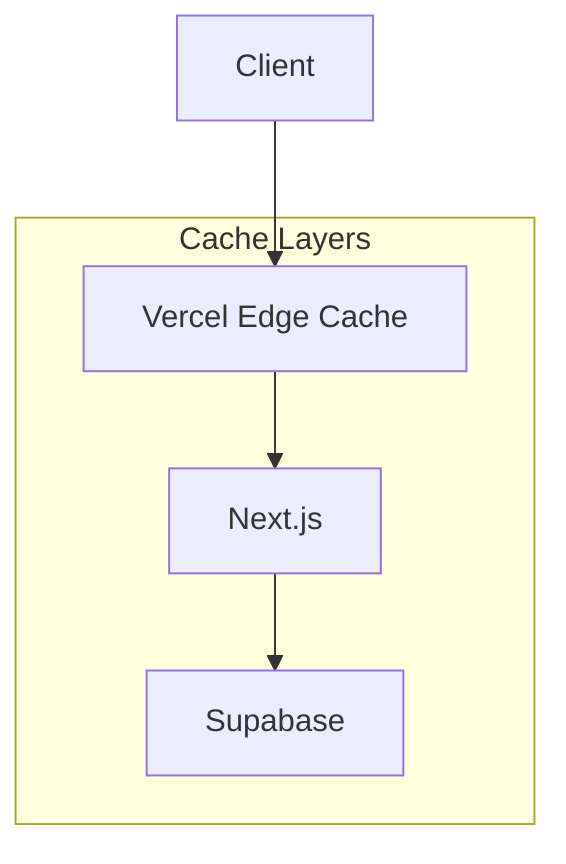
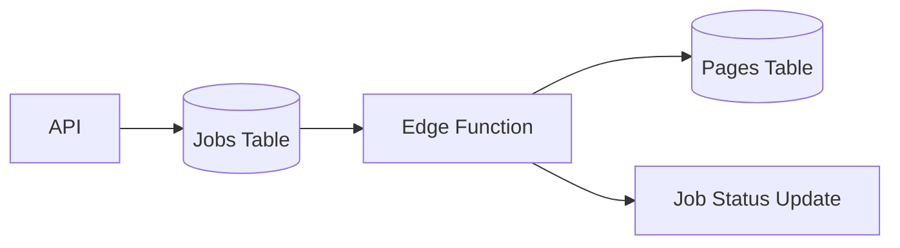

# アーキテクチャ設計

Plain Text Scraperのシステムアーキテクチャについて説明します。

## 🏗️ システム概要



## 🎯 技術スタック

### フロントエンド
- **Next.js 14**: App Router, Server Components
- **TypeScript**: 型安全性
- **Tailwind CSS**: スタイリング
- **SWR**: データフェッチング

### バックエンド
- **Supabase**: BaaS（Backend as a Service）
- **PostgreSQL**: メインデータベース
- **Edge Functions**: サーバーレス実行環境（Deno）
- **Row Level Security**: データセキュリティ

### インフラストラクチャ
- **Vercel**: フロントエンドホスティング
- **Supabase**: バックエンドサービス
- **CDN**: Vercel Edge Network

## 📊 データフロー

### 1. スクレイピングリクエスト



### 2. リアルタイム更新



## 🗄️ データベース設計

### ERD（Entity Relationship Diagram）



### インデックス戦略

```sql
-- パフォーマンス最適化
CREATE INDEX pages_user_created_idx ON pages(user_id, created_at DESC);
CREATE INDEX jobs_user_status_idx ON jobs(user_id, status, created_at DESC);
CREATE INDEX quotas_window_idx ON quotas(user_id, window_start);

-- 全文検索
CREATE INDEX pages_fts_idx ON pages
USING gin (to_tsvector('simple', coalesce(title,'') || ' ' || coalesce(content,'')));
```

## 🔐 セキュリティアーキテクチャ

### Row Level Security (RLS)

```sql
-- すべてのテーブルでRLS有効
ALTER TABLE profiles ENABLE ROW LEVEL SECURITY;
ALTER TABLE pages ENABLE ROW LEVEL SECURITY;
ALTER TABLE jobs ENABLE ROW LEVEL SECURITY;
ALTER TABLE quotas ENABLE ROW LEVEL SECURITY;

-- ユーザーは自分のデータのみアクセス可能
CREATE POLICY "Users can access own data" ON pages
  FOR ALL USING (auth.uid() = user_id);
```

### 認証フロー



### API セキュリティ

- **JWT認証**: すべてのAPIエンドポイント
- **Rate Limiting**: 1分間5回制限
- **Input Validation**: URL検証、サニタイゼーション
- **CORS**: 適切なオリジン制限

## ⚡ パフォーマンス設計

### フロントエンド最適化

```typescript
// Server Components活用
export default async function Dashboard() {
  const initialData = await fetchInitialData()
  return <DashboardClient initialData={initialData} />
}

// 動的インポート
const HeavyComponent = dynamic(() => import('./HeavyComponent'))

// 画像最適化
<Image src="/hero.jpg" alt="Hero" width={800} height={600} priority />
```

### キャッシュ戦略



### Edge Functions最適化

```typescript
// 並列処理
const [robotsTxt, html] = await Promise.all([
  fetchRobotsTxt(hostname),
  fetchHtml(url)
])

// メモリ効率
const content = extractContent(html)
html = null // GC対象にする
```

## 🔄 スケーラビリティ

### 水平スケーリング

- **Vercel**: 自動スケーリング
- **Supabase**: 接続プーリング
- **Edge Functions**: 自動スケーリング

### データベーススケーリング

```sql
-- パーティショニング（将来的）
CREATE TABLE pages_2025 PARTITION OF pages
FOR VALUES FROM ('2025-01-01') TO ('2026-01-01');

-- 読み取り専用レプリカ
-- Supabase Proプランで利用可能
```

### 監視とメトリクス

```typescript
// アプリケーションメトリクス
const metrics = {
  scraping_requests: Counter,
  scraping_duration: Histogram,
  error_rate: Gauge,
  active_users: Gauge
}
```

## 🚨 エラーハンドリング

### エラー分類

```typescript
type ErrorType =
  | 'VALIDATION_ERROR'      // 入力検証エラー
  | 'AUTHENTICATION_ERROR'  // 認証エラー
  | 'RATE_LIMIT_ERROR'     // レート制限
  | 'ROBOTS_BLOCKED'       // robots.txt拒否
  | 'FETCH_ERROR'          // 外部サイト取得失敗
  | 'EXTRACTION_ERROR'     // テキスト抽出失敗
  | 'DATABASE_ERROR'       // DB操作失敗
  | 'INTERNAL_ERROR'       // その他
```

### 再試行戦略

```typescript
// 指数バックオフ再試行
async function retryWithBackoff<T>(
  fn: () => Promise<T>,
  maxRetries: number = 3
): Promise<T> {
  for (let i = 0; i < maxRetries; i++) {
    try {
      return await fn()
    } catch (error) {
      if (i === maxRetries - 1) throw error
      await sleep(Math.pow(2, i) * 1000)
    }
  }
}
```

## 🔄 非同期処理設計

### ジョブキューパターン



### ポーリング vs WebSocket

**現在**: ポーリング（SWR）
**将来**: Supabase Realtime（WebSocket）

```typescript
// 現在（ポーリング）
const { data: job } = useSWR(
  jobId ? `/api/jobs/${jobId}` : null,
  fetcher,
  { refreshInterval: 2000 }
)

// 将来（リアルタイム）
useEffect(() => {
  const subscription = supabase
    .channel('jobs')
    .on('postgres_changes',
      { event: 'UPDATE', schema: 'public', table: 'jobs' },
      handleJobUpdate
    )
    .subscribe()

  return () => subscription.unsubscribe()
}, [])
```

## 🏛️ アーキテクチャ原則

### 1. Single Responsibility
- 各コンポーネントは単一の責任
- API Routesは薄いレイヤー
- Edge Functionsはビジネスロジック

### 2. Separation of Concerns
- UI ⟷ Business Logic ⟷ Data Layer
- 認証・認可の分離
- エラーハンドリングの一元化

### 3. Fail Fast
- 早期の入力検証
- 明示的なエラーハンドリング
- Circuit Breaker パターン

### 4. Defense in Depth
- 多層セキュリティ
- Rate Limiting + RLS + JWT
- robots.txt + タイムアウト + サイズ制限

## 📈 将来的な拡張

### Phase 2: 機能拡張
- バッチ処理
- スケジューリング
- Webhook通知

### Phase 3: スケール対応
- Redis キャッシュ
- 読み取り専用レプリカ
- CDN最適化

### Phase 4: 企業対応
- テナント分離
- 監査ログ
- SLA保証

## 📋 技術的制約

### Supabase制限
- Edge Function: 256MB RAM, 400s timeout
- Database: 最大接続数制限
- Storage: ファイルサイズ制限

### Vercel制限
- Function実行時間: 最大30秒
- 帯域制限: プランによる
- 環境変数数: 最大100個

### 外部API制限
- robots.txt: サイトによる制限
- Rate Limiting: サイトによる制限
- JavaScript必須サイト: 現在未対応

この設計により、スケーラブルで保守性の高いアプリケーションを実現しています。