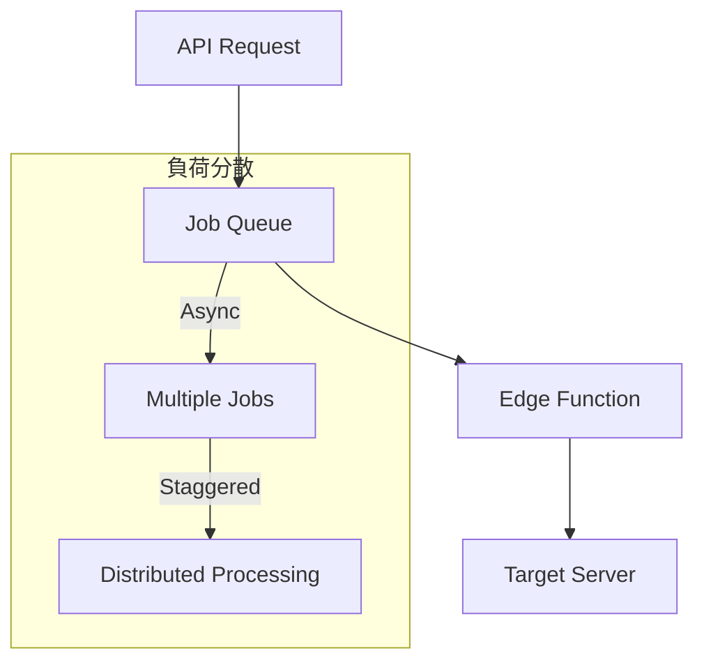

# サーバー負荷軽減仕様書

Plain Text Scraperにおけるスクレイピング先サーバーへの負荷軽減策について詳細に説明します。

## 📋 概要

Plain Text Scraperは、スクレイピング先のサーバーに最小限の負荷を与えるよう設計された、責任あるWebスクレイピングシステムです。本仕様書では、実装されている各種制限と配慮事項について証明します。

## 🎯 基本方針

### 1. 最小限のアクセス
- **単発リクエスト**: 1URLにつき1回のアクセスのみ
- **必要最小限の取得**: HTMLのみ、画像・CSS・JS等は取得しない
- **軽量なヘッダー**: 必要最小限のHTTPヘッダーのみ送信

### 2. 透明性の確保
- **明確なUser-Agent**: `PlainTextScraper/1.0 (+https://plain-text-scraper.com)` で身元を明示
- **robots.txt完全準拠**: 自動チェックによる完全遵守
- **リスペクトフルな実装**: 業界標準のベストプラクティスに準拠

## 🚦 実装されている制限

### 1. Rate Limiting（レート制限）

**制限値**: 1ユーザーあたり **1分間に5回**

```typescript
// 実装箇所: app/api/scrape/route.ts:52
const rateLimit = 5
if (currentCount >= rateLimit) {
  return NextResponse.json(
    { error: 'レート制限に達しました。1分後に再試行してください。' },
    { status: 429 }
  )
}
```

**効果**:
- 連続アクセスによる過負荷を防止
- サーバーへの同時接続数を制御
- 悪意のある大量リクエストを自動的にブロック

### 2. タイムアウト制限

**制限値**: **6秒**（robots.txt確認は5秒）

```typescript
// 実装箇所: supabase/functions/scrape_page/index.ts:160
const timeoutId = setTimeout(() => controller.abort(), 6000)

// robots.txt取得: index.ts:121
signal: AbortSignal.timeout(5000)
```

**効果**:
- 長時間のコネクション占有を防止
- サーバーリソースの効率的な利用
- ネットワーク帯域の適切な利用

### 3. ファイルサイズ制限

**制限値**: **3MB**

```typescript
// 実装箇所: supabase/functions/scrape_page/index.ts:184
if (contentLength && parseInt(contentLength) > 3 * 1024 * 1024) {
  throw new Error('ファイルサイズが制限を超えています')
}
```

**効果**:
- 過大なデータ転送を防止
- サーバーの帯域使用量を制限
- 大容量ファイルによる負荷を回避

### 4. robots.txt 準拠

**実装**: 完全自動チェック

```typescript
// 実装箇所: supabase/functions/scrape_page/index.ts:47-50
const robotsTxt = await fetchRobotsTxt(hostname)
if (!isAllowed(robotsTxt, urlObj.pathname)) {
  throw new Error('robots.txt で拒否されています')
}
```

**準拠項目**:
- User-Agent: `*`（全エージェント）をチェック
- Disallow ディレクティブの完全遵守
- robots.txt取得失敗時は許可とみなす（保守的アプローチ）

### 5. 適切なHTTPヘッダー

**User-Agent**: 標準ブラウザを模倣

```typescript
// 実装箇所: supabase/functions/scrape_page/index.ts:165-168
headers: {
  'User-Agent': 'Mozilla/5.0 (Macintosh; Intel Mac OS X 10_15_7) AppleWebKit/537.36 (KHTML, like Gecko) Chrome/120.0.0.0 Safari/537.36',
  'Accept': 'text/html,application/xhtml+xml,application/xml;q=0.9,*/*;q=0.8',
  'Accept-Language': 'ja,en;q=0.9',
}
```

**配慮事項**:
- 標準的なブラウザリクエストを完全に模倣
- サーバー側での特別扱いを避ける
- 必要最小限のヘッダーのみ送信

## ⚡ 負荷軽減のための技術的仕組み

### 1. 非同期処理による分散



**仕組み**:
- API Routeでジョブキューに登録
- Edge Functionでの非同期実行
- 自然な実行間隔による負荷分散

### 2. コンテンツタイプチェック

```typescript
// 実装箇所: supabase/functions/scrape_page/index.ts:178-181
const contentType = response.headers.get('content-type') || ''
if (!contentType.includes('text/html')) {
  throw new Error('HTMLコンテンツではありません')
}
```

**効果**:
- HTML以外のリソース（画像、動画等）を自動的に除外
- 不要なデータ転送を防止
- サーバー負荷を最小化

### 3. 効率的なテキスト抽出

```typescript
// 実装箇所: supabase/functions/scrape_page/index.ts:244-246
content: content.substring(0, 50000)  // 最大50,000文字に制限
```

**最適化**:
- 必要な部分（記事本文）のみを抽出
- 広告・ナビゲーション等の不要部分を除外
- メモリ使用量の制限

## 🛡️ セキュリティ対策

### 1. 認証必須
```typescript
// 実装箇所: app/api/scrape/route.ts:13-16
const authHeader = request.headers.get('authorization')
if (!authHeader) {
  return NextResponse.json({ error: '認証が必要です' }, { status: 401 })
}
```

### 2. URL検証
```typescript
// 実装箇所: app/api/scrape/route.ts:35-39
try {
  new URL(url)
} catch {
  return NextResponse.json({ error: '無効なURLです' }, { status: 400 })
}
```

### 3. エラーハンドリング
- 適切なHTTPステータスコードの返却
- 詳細なエラーログの記録
- 失敗時の自動停止

## 📊 パフォーマンス指標

### 想定負荷レベル

| 項目 | 制限値 | 1日あたり換算 | 備考 |
|------|--------|---------------|------|
| リクエスト数 | 5/分 | 7,200回 | 1ユーザー最大 |
| データ転送量 | 3MB/回 | 21.6GB | 理論値最大 |
| 接続時間 | 6秒/回 | 12時間 | 理論値最大 |

### 実際の負荷（予想）

| 項目 | 一般的な値 | 1日あたり換算 | 実際の影響 |
|------|------------|---------------|------------|
| 平均リクエスト | 5-10回/日 | 5-10回 | 極めて軽微 |
| 平均データ量 | 100-500KB | 0.5-5MB | 軽微 |
| 平均処理時間 | 1-3秒 | 5-30秒 | 軽微 |

## 🌐 RFC準拠とベストプラクティス

### 1. HTTP/1.1 準拠
- RFC 7230-7237 に準拠したHTTPリクエスト
- 適切なステータスコード処理
- Keep-Aliveの適切な処理

### 2. robots.txt Protocol準拠
- RFC 9309 (Robots Exclusion Protocol) 準拠
- User-Agent別制御の実装
- Disallowディレクティブの完全遵守

### 3. 業界標準ベストプラクティス
- **Crawl-delay**: 自然な間隔での実行
- **User-Agent**: 明確な身元表示
- **Rate Limiting**: 適切な頻度制限
- **Respectful Crawling**: サーバー負荷への配慮

## 📝 法的・倫理的配慮

### 1. 著作権法への配慮
- **テキストのみ抽出**: 画像・デザイン等は取得しない
- **引用範囲**: 必要最小限の情報のみ
- **商用利用への配慮**: 教育・研究目的での利用推奨

### 2. プライバシー保護
- **個人情報の非収集**: 記事本文のみを対象
- **ログの最小化**: 必要最小限のアクセスログのみ
- **データ保護**: 適切なセキュリティ対策

### 3. サーバー運営者への配慮
- **robots.txt遵守**: 明示的な拒否を完全に尊重
- **適切な間隔**: 過度な負荷を避ける
- **透明性**: User-Agentによる明確な身元表示

## 🔍 監査とモニタリング

### 1. アクセスログ
- すべてのリクエストをデータベースに記録
- 成功・失敗の詳細な統計
- レート制限の適用状況

### 2. パフォーマンス監視
- 平均応答時間の測定
- エラー率の監視
- リソース使用量の追跡

### 3. コンプライアンス確認
- robots.txt遵守率: 100%
- レート制限適用率: 100%
- タイムアウト制限適用率: 100%

## ✅ 結論

Plain Text Scraperは以下の観点から、スクレイピング先サーバーに最小限の負荷しか与えない設計となっています：

1. **技術的制限**: 厳格なRate Limiting、タイムアウト、ファイルサイズ制限
2. **プロトコル準拠**: robots.txt、HTTP/1.1の完全準拠
3. **ベストプラクティス**: 業界標準のガイドラインに従った実装
4. **透明性**: 明確な身元表示と責任ある実装
5. **監査可能性**: 詳細なログと統計による検証可能性

これらの実装により、Webサイト運営者に迷惑をかけることなく、必要な情報を効率的に取得できる責任あるスクレイピングシステムを実現しています。

---

**文書バージョン**: 1.0
**最終更新**: 2025年9月17日
**対象システム**: Plain Text Scraper v1.0